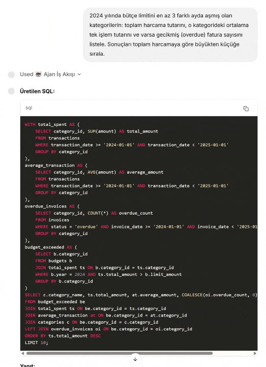

# Finans Asistanı — Çok Ajanlı Text-to-SQL Chatbot


Doğal dildeki finansal soruları SQL sorgularına çeviren, veritabanında çalıştıran,
sonuçları yorumlayan ve interaktif grafikler üreten çok ajanlı bir chatbot.

---

## Önizleme

### Senaryo 1 — Basit Sorgu & Grafik


### Senaryo 2 — Karmaşık Çok Tablolu Analiz



---

## Mimari


### LangGraph State Machine

Aşağıdaki diyagram, LangGraph tarafından otomatik üretilen gerçek iş akışını göstermektedir.


```
Kullanıcı (Chainlit UI)
        ↓
guardrails_agent      → Kapsam & selamlama filtresi
        ↓
sql_agent             → Doğal dil → SQLite sorgusu
        ↓
sql_validator_agent   → Fan-out (kartezyen çarpım) tespiti ve CTE düzeltmesi
        ↓
execute_sql           → finance.db üzerinde sorgu çalıştırma
        ↓ (hata)
error_agent ──────────→ execute_sql   (max 3 deneme)
        ↓ (başarı)
sanity_check_agent    → Sonuçlar mantıklı mı? Değilse sql_agent'e geri dön
        ↓
analysis_agent        → Ham sonuç → okunabilir metin yanıt
        ↓
decide_graph_need     → Grafik gerekli mi, hangi tür?
        ↓ (gerekiyorsa)
viz_agent             → Plotly kodu üret ve çalıştır
        ↓
Chainlit UI           → SQL + metin yanıt + interaktif grafik
```

### Ajan Rolleri

| Ajan | Görev |
|---|---|
| `guardrails_agent` | Finans kapsamı dışı ve selamlama tespiti |
| `sql_agent` | Doğal dil → SQLite (şema + kural farkındalıklı) |
| `sql_validator_agent` | Fan-out pattern tespiti; riskli sorgularda CTE yeniden yazımı |
| `execute_sql` | Sorgu çalıştırma; çoklu ifade desteği |
| `error_agent` | Başarısız SQL analizi ve düzeltme (max 3×) |
| `sanity_check_agent` | Sonuç akıl yürütme; şişmiş/imkânsız değerleri tespit |
| `analysis_agent` | Sorgu sonuçlarını kullanıcı diline çevirme |
| `decide_graph_need` | Grafik türü kararı (bar/line/pie/scatter) |
| `viz_agent` | LLM ile Plotly kodu üretme ve çalıştırma |

---

## Teknoloji Yığını

| Katman | Araç |
|---|---|
| Ajan orkestrasyonu | LangGraph 1.0.3 |
| Web arayüzü | Chainlit 2.9.0 |
| LLM | OpenAI GPT-4o-mini |
| Veritabanı | SQLite3 (yerel) |
| Veri işleme | Pandas 2.3.3 |
| Görselleştirme | Plotly 6.4.0 |

---

## Veritabanı Şeması

Sentetik finans verisi (2024–2025):

| Tablo | Açıklama | Satır |
|---|---|---|
| `accounts` | Banka hesapları ve bakiyeler | 5 |
| `categories` | Gelir/gider kategorileri | 15 |
| `transactions` | Tüm finansal işlemler | ~510 |
| `budgets` | Aylık kategori bütçeleri | 240 |
| `invoices` | Faturalar ve ödeme durumları | 200 |

---

## Kurulum

### 1. Depoyu klonla

```bash
git clone https://github.com/kullanici-adi/finans-asistani.git
cd finans-asistani
```

### 2. Sanal ortam oluştur

```bash
python -m venv venv

# Windows
venv\Scripts\activate

# macOS / Linux
source venv/bin/activate
```

### 3. Bağımlılıkları yükle

```bash
pip install -r requirements.txt
```

### 4. Ortam değişkenini ayarla

```bash
cp .env.example .env
# .env dosyasını aç ve OPENAI_API_KEY değerini gir
```

API anahtarı için: [platform.openai.com/api-keys](https://platform.openai.com/api-keys)

### 5. Veritabanını oluştur

```bash
python db_init.py
```

Sentetik finans verisi üretilir ve `finance.db` dosyası oluşturulur.

### 6. Uygulamayı başlat

```bash
chainlit run app.py
```

Tarayıcıda aç: **http://localhost:8000**

---

## Örnek Sorular

```
Bu yılki toplam gelir ve giderim ne kadar?
En çok harcama yaptığım 5 kategori neler?
Hangi aylarda bütçemi aştım?
Ödenmemiş veya gecikmiş faturalarım var mı?
Kredi kartı ile yapılan harcamaların toplamı nedir?
2024 yılında bütçe limitini en az 3 farklı ayda aşmış kategorilerin
toplam harcama tutarını ve gecikmiş fatura sayısını listele.
```

---

## Proje Yapısı

```
finans-asistani/
│
├── app.py                   # Chainlit arayüzü ve olay yöneticileri
├── text2sql_agent.py        # LangGraph ajan motoru (tüm iş akışı)
├── db_init.py               # Sentetik veri üretimi ve veritabanı kurulumu
├── finance.db               # SQLite veritabanı (db_init.py ile üretilir)
├── requirements.txt         # Python bağımlılıkları
├── chainlit.md              # Karşılama ekranı metni
├── .env.example             # API anahtarı şablonu
│
├── images/
│   ├── Scenario-1.gif       # Basit sorgu & grafik demosu
│   ├── Scenario-2.gif       # Karmaşık analiz demosu
│   ├── architecture_diagram.png   # Sistem mimarisi diyagramı
│   ├── finance_workflow.png       # LangGraph iş akışı (otomatik üretilen)
│   └── text2sql_workflow.png      # Ek akış diyagramı
│
└── .chainlit/
    └── config.toml          # Chainlit uygulama ayarları
```

---

## Lisans

MIT
