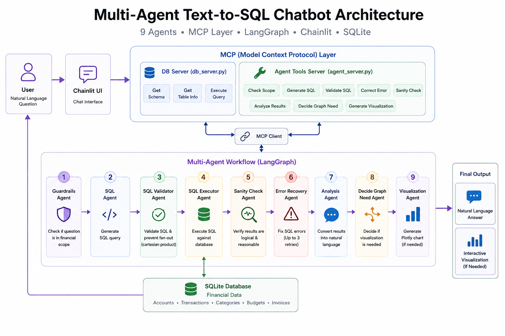

# Finance Assistant — Multi-Agent Text-to-SQL Chatbot with MCP


A production-ready multi-agent chatbot that converts natural language
financial questions into SQL queries, executes them against a database,
interprets the results, and generates interactive charts — all orchestrated
through a **Model Context Protocol (MCP) layer**.

---

## Architecture



*User → Chainlit UI → LangGraph Multi-Agent Workflow → MCP Client → MCP Layer → SQLite / OpenAI GPT-4o-mini → Final Response*

### Agent Workflow

```
User Question
    ↓
🛡️  Guardrails Agent     → Scope & greeting filter
    ↓
📝 SQL Agent             → Natural language → SQLite query
    ↓
🔍 SQL Validator Agent   → Fan-out detection & CTE rewrite
    ↓
⚙️  Execute SQL          → Run query against finance.db
    ├── success → 🧠 Sanity Check Agent → Verify results make sense
    │       ├── passed → 💬 Analysis Agent
    │       └── failed → back to 📝 SQL Agent (max 1 retry)
    │
    └── error → 🔧 Error Recovery Agent → corrected SQL → back to ⚙️ Execute SQL
                 max 3 retries, then graceful fallback
    ↓
💬 Analysis Agent        → Raw data → natural language
    ↓
📊 Decide Graph Need     → Chart needed? Which type?
    ↓ (if chart)
📈 Viz Agent             → Generate interactive Plotly chart
    ↓
✅ Response to User      → Text + SQL + Interactive Chart
```

### Agent Roles

| Agent | Role | MCP Tool |
|---|---|---|
| `guardrails_agent` | Scope & greeting filter | `check_scope` |
| `sql_agent` | NL → SQLite query generation | `generate_sql` |
| `sql_validator_agent` | Fan-out detection & CTE rewrite | `validate_sql` |
| `execute_sql` | SQL execution node (multi-statement) | `execute_query` |
| `error_agent` | Failed SQL analysis & correction (max 3×) | `fix_sql_error` |
| `sanity_check_agent` | Result reasonability verification | `check_sanity` |
| `analysis_agent` | Raw results → natural language | `analyze_results` |
| `decide_graph_need` | Chart type decision (bar/line/pie/scatter) | `decide_graph_need` |
| `viz_agent` | LLM-powered Plotly code generation | `generate_plotly` |

### Final Output

Each response may include:

- **Natural language answer** — human-readable interpretation of results
- **Generated SQL query** — the exact SQLite query that was executed
- **Query results summary** — formatted data from the database
- **Interactive Plotly chart** — bar, line, pie, or scatter chart (when data warrants visualization)

---

## Runtime Flow

1. User sends a financial question through Chainlit.
2. Chainlit forwards the message to the LangGraph workflow.
3. LangGraph routes the question through 9 specialized agents.
4. Agents access tools only through the MCP client.
5. MCP servers expose database and LLM-powered tools.
6. SQL is generated, validated, executed, checked, analyzed, and optionally visualized.
7. Final response is streamed back to Chainlit.

---

## Tech Stack

| Layer | Technology | Version |
|---|---|---|
| Agent Orchestration | LangGraph | 1.0.3 |
| Web Interface | Chainlit | 2.9.0 |
| MCP Protocol | MCP Python SDK | 1.0+ |
| LLM | OpenAI GPT-4o-mini | — |
| Database | SQLite3 | Built-in |
| Data Processing | Pandas | 2.3.3 |
| Visualization | Plotly | 6.4.0 |
| Config | Pydantic Settings | 2.0+ |

---

## Database Schema

Synthetic financial data (2024–2025, English):

| Table | Description | Rows |
|---|---|---|
| `accounts` | Bank accounts and balances | 5 |
| `categories` | Income/expense categories | 15 |
| `transactions` | All financial transactions | ~510 |
| `budgets` | Monthly category budgets | 240 |
| `invoices` | Invoices and payment statuses | 200 |

---

## Setup

### 1. Clone the repository

```bash
git clone https://github.com/m-peker/mcp-finance-agent.git
cd mcp-finance-agent
```

### 2. Create a virtual environment

```bash
python -m venv venv

# Windows
venv\Scripts\activate

# macOS / Linux
source venv/bin/activate
```

### 3. Install dependencies

```bash
pip install -r requirements.txt
```

### 4. Set environment variables

```bash
cp .env.example .env
# Open .env and enter your OPENAI_API_KEY
```

API key: [platform.openai.com/api-keys](https://platform.openai.com/api-keys)

### 5. Initialize the database

```bash
python db_init.py
```

Generates synthetic financial data and creates `finance.db`.

### 6. Start the application

```bash
chainlit run app.py
```

Open: **http://localhost:8000**

---

## Sample Questions

```
What is my total income and expenses this year?
What are my top 5 spending categories?
Which months did I exceed my budget?
Do I have any unpaid or overdue invoices?
What is the total spent via credit card?
List categories that exceeded their budget in at least 3 different months
in 2024, along with their total spending and overdue invoice counts.
```

---

## Project Structure

```
finance-assistant/
│
├── app.py                      # Chainlit UI & event handlers
├── graph.py                    # LangGraph state machine definition
├── stream.py                   # Async streaming interface
├── config.py                   # Configuration & schema definitions
├── db_init.py                  # Synthetic data generation
├── finance.db                  # SQLite database (auto-generated)
├── requirements.txt            # Python dependencies
├── chainlit.md                     # Welcome screen
├── medium-article.md               # Full Medium article about this project
├── .env.example                    # API key template
│
├── mcp_servers/                # Model Context Protocol servers
│   ├── __init__.py
│   ├── db_server.py            # Database tools (schema, query, info)
│   └── agent_server.py         # LLM-powered agent tools
│
├── agents/                     # LangGraph agent nodes
│   ├── __init__.py
│   ├── mcp_client.py           # MCP client wrapper
│   └── nodes.py                # All 9 agent node implementations
│
├── images/
│   └── architecture_diagram.png    # High-level system architecture diagram
│
├── .chainlit/
│   ├── config.toml                 # Chainlit application settings
│   └── translations/               # UI translations (gitignored)
```

---

## Key Design Decisions

### MCP Layer
Every agent operation goes through the Model Context Protocol layer.
Agents call `MCPClient.call_tool("db"|"agent", tool_name, args)` —
never direct functions. This means:
- **Modularity**: Swap implementations without touching agents
- **Testability**: Mock MCP servers for unit testing
- **Production readiness**: MCP servers can run as separate processes over stdio

### Deterministic Fan-Out Detection
Before calling the LLM for SQL validation, a pure Python check runs:
```python
has_join = " JOIN " in sql.upper()
has_agg  = any(f in sql.upper() for f in ["SUM(", "COUNT(", "AVG("])
has_cte  = sql.upper().startswith("WITH ")
```
~70-80% of queries pass this check without an LLM call — saving cost and latency.

### Loop Guards
- SQL error retries: maximum 3 attempts
- Sanity check retries: maximum 1 attempt (prevents infinite loops)

---

## License

MIT
