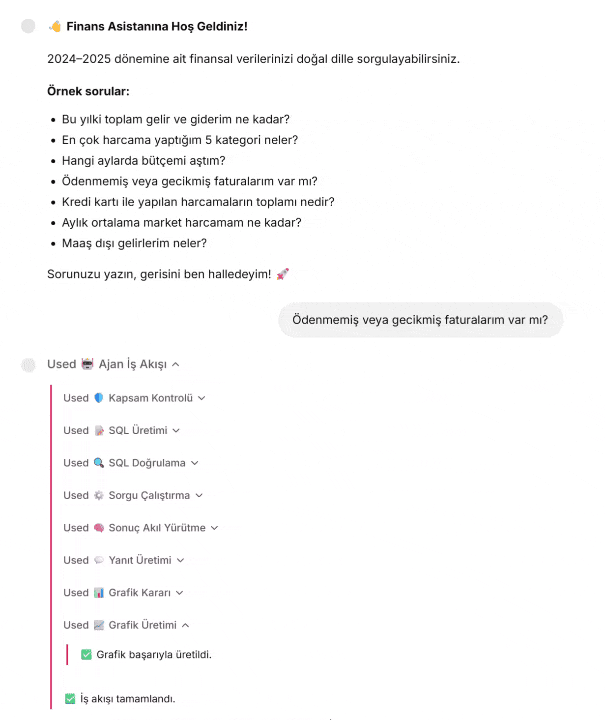
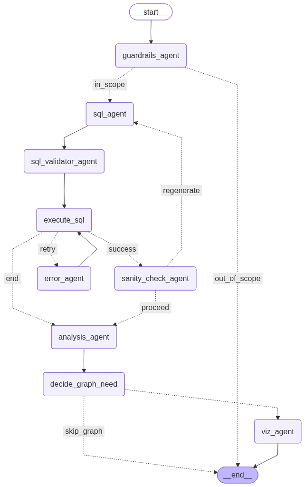

# Building a Production-Ready Multi-Agent Text-to-SQL Chatbot with MCP, LangGraph & Chainlit 🚀

> *How to build an end-to-end AI assistant that converts natural language to SQL, executes queries, interprets results, and generates interactive charts — all orchestrated through a Model Context Protocol (MCP) layer.*

---

Today, I'm going to walk you through building a **multi-agent chatbot** that takes natural language financial questions, converts them into SQL queries, runs them against a database, interprets the results in plain language, and — when appropriate — generates interactive Plotly charts. 

This isn't just a demo. It's a production-pattern architecture using **LangGraph**, **MCP (Model Context Protocol)**, **GPT-4o-mini**, and **Chainlit** — designed to be modular, testable, and resilient.

Let's dive in.

---

## 📌 Table of Contents

1. [What Is This Project?](#what-is-this-project)
2. [Why Multi-Agent Architecture?](#why-multi-agent-architecture)
3. [The MCP Layer — What It Is and Why It Matters](#the-mcp-layer--what-it-is-and-why-it-matters)
4. [Architecture Overview](#architecture-overview)
5. [LangGraph Workflow — Deep Dive](#langgraph-workflow--deep-dive)
6. [Nine Agents, Nine Responsibilities](#nine-agents-nine-responsibilities)
7. [Database Design & Synthetic Data](#database-design--synthetic-data)
8. [Tech Stack](#tech-stack)
9. [Setup & Running](#setup--running)
10. [A Journey Into the Code](#a-journey-into-the-code)
11. [Challenges and Solutions](#challenges-and-solutions)
12. [Conclusion & Future Vision](#conclusion--future-vision)

---

## What Is This Project?

The **Finance Assistant** is a chatbot that lets users query their financial data using plain English — no SQL knowledge required.

You type a question like *"What are my top 5 spending categories this year?"* and the system:

1. Verifies the question is within financial scope
2. Generates a valid SQLite query
3. Validates it for fan-out (cartesian product) risks
4. Executes it against the database
5. Runs a sanity check on the results
6. Interprets the raw data in natural language
7. Decides if a chart would be helpful
8. Generates an interactive Plotly visualization

All of this happens through **9 specialized agents** communicating exclusively via an MCP tool layer.



The project uses **synthetic financial data** covering 2024–2025:

- 💳 5 bank accounts with current balances
- 📊 15 income/expense categories
- 🧾 ~510 financial transactions
- 🎯 240 monthly budget records
- 📄 200 invoices

---

## Why Multi-Agent Architecture?

You could technically do "question → SQL → execute → answer" with a single LLM call. So why use **9 separate agents**?

Because in the real world, things go wrong — and a single monolithic prompt can't handle every edge case gracefully:

| Problem | Single-Agent Approach | Multi-Agent Approach |
|---|---|---|
| Out-of-scope question ("What's the weather?") | Tries to generate SQL, fails with a cryptic error | **Guardrails Agent** catches it early, politely declines |
| JOIN fan-out (cartesian product multiplication) | Returns inflated, silently wrong results | **SQL Validator** detects risk and rewrites using CTEs |
| SQL syntax error | Shows raw error to the user | **Error Agent** analyzes the error and corrects it (up to 3 retries) |
| Illogical/inflated results | Delivers wrong answer with confidence | **Sanity Check Agent** flags suspicious results, regenerates SQL |
| Chart decision | Always shows a chart, or never does | **Decide Agent** inspects the data structure and decides |

Each agent follows the **Single Responsibility Principle** — it does one thing and does it well. The result is a system that's more reliable, more predictable, and capable of **self-correction** when errors occur.

---

## The MCP Layer — What It Is and Why It Matters

The defining architectural feature of this project is the **Model Context Protocol (MCP) layer**.

### What Is MCP?

MCP is an open protocol developed by Anthropic that standardizes how AI models communicate with external tools — databases, APIs, file systems, and more. Think of it as **USB-C for AI tools**: a universal standard that any model can use to connect to any tool.

### How MCP Works in This Project

Agents (LangGraph nodes) **never make direct function calls**. Every operation flows through the MCP layer:

```
Agent Node (e.g., sql_agent)
        │
        ▼
MCPClient.call_tool("agent", "generate_sql", {...})
        │
        ├── "db"    → DBServerTools  (get_schema, execute_query, get_table_info)
        └── "agent" → AgentToolsServer (check_scope, generate_sql, validate_sql, ...)
```

### Two MCP Servers

**1. DB Server (`mcp_servers/db_server.py`):**
Handles all database operations — schema retrieval, query execution, and table inspection.

**2. Agent Tools Server (`mcp_servers/agent_server.py`):**
Wraps all LLM-powered operations — scope checking, SQL generation, validation, error correction, sanity checking, analysis, graph decision, and visualization code generation.

### Why This Matters

| Benefit | Explanation |
|---|---|
| **Modularity** | Swap out a server implementation without touching agent code |
| **Testability** | Mock MCP servers for isolated unit tests |
| **Production-Ready** | MCP servers can run as separate processes over stdio/SSE |
| **Reusability** | The same MCP servers can serve other projects |

```python
# MCPClient — the single communication point all agents use
class MCPClient:
    def call_tool(self, server: str, tool_name: str, arguments: dict) -> str:
        handler = self._servers[server]  # "db" or "agent"
        return handler.handle_tool(tool_name, arguments)

# Example usage from any agent:
result = mcp_client.call_tool("db", "execute_query", {"sql": "SELECT ..."})
result = mcp_client.call_tool("agent", "generate_sql", {"question": "..."})
```

---

## Architecture Overview

Here's the high-level system architecture:


*High-level system architecture: Chainlit UI → LangGraph Agent Engine (9 agents) → MCP Layer (DB Server + Agent Tools Server) → SQLite & OpenAI GPT-4o-mini → Interactive Plotly Charts*

The complete data flow:

```
User Question
    ↓
🛡️  Guardrails Agent     → "Is this about financial data?"
    ↓ (yes)
📝 SQL Agent             → Natural language → SQLite query
    ↓
🔍 SQL Validator Agent   → Fan-out risk? → CTE rewrite
    ↓
⚙️  Execute SQL          → Run query against finance.db
    ↓ (if error)
🔧 Error Agent           → Analyze error, fix SQL, retry (max 3×)
    ↓ (success)
🧠 Sanity Check Agent    → Are the results reasonable?
    ↓
💬 Analysis Agent        → Raw data → readable response
    ↓
📊 Decide Graph Need     → Chart needed? Which type?
    ↓ (if chart)
📈 Viz Agent             → Generate and execute Plotly code
    ↓
✅ Response to User      → Text + SQL + Interactive Chart
```

The LangGraph workflow graph, auto-generated from the code:



---

## LangGraph Workflow — Deep Dive

The heart of the project is a **LangGraph StateGraph** — a state machine that orchestrates agent transitions, conditional routing, and loops.

### The Shared State

All agents share a single `AgentState` object that carries context across the workflow:

```python
class AgentState(TypedDict):
    question:         str    # User's natural language question
    sql_query:        str    # Generated or corrected SQL
    query_result:     str    # Query results (JSON)
    final_answer:     str    # Natural language response for the user
    error:            str    # Error message (empty if no error)
    iteration:        int    # Current retry attempt counter
    needs_graph:      bool   # Should a chart be generated?
    graph_type:       str    # bar | line | pie | scatter
    graph_json:       str    # Plotly figure JSON for Chainlit
    is_in_scope:      bool   # Is the question about financial data?
    sanity_passed:    bool   # Are results reasonable?
    sanity_issue:     str    # Description of detected issue
    sanity_retried:   bool   # Loop guard — regenerate only once
```

### Conditional Routing

LangGraph uses **conditional edge functions** to decide where to go after each step:

```python
# Scope check — proceed or stop?
def check_scope(state):
    return "in_scope" if state.get("is_in_scope") else "out_of_scope"

# SQL execution — retry, proceed, or give up?
def should_retry(state):
    if state.get("error"):
        return "retry" if state.get("iteration", 0) <= 3 else "end"
    return "success"

# Sanity check — regenerate SQL or continue?
def should_regenerate_sql(state):
    return "regenerate" if not state.get("sanity_passed") else "proceed"

# Graph decision — visualize or skip?
def should_generate_graph(state):
    return "viz_agent" if state.get("needs_graph") else "skip_graph"
```

This makes the workflow **dynamic, not linear** — just like a real team of specialists collaborating on a problem. The workflow builder in `graph.py` registers all nodes and edges:

```python
def create_finance_graph():
    workflow = StateGraph(AgentState)
    
    # Register all 9 agent nodes
    workflow.add_node("guardrails_agent",    guardrails_agent)
    workflow.add_node("sql_agent",           sql_agent)
    workflow.add_node("sql_validator_agent", sql_validator_agent)
    workflow.add_node("execute_sql",         execute_sql)
    workflow.add_node("sanity_check_agent",  sanity_check_agent)
    workflow.add_node("analysis_agent",      analysis_agent)
    workflow.add_node("error_agent",         error_agent)
    workflow.add_node("decide_graph_need",   decide_graph_need)
    workflow.add_node("viz_agent",           viz_agent)
    
    # Define edges and conditional branches
    workflow.set_entry_point("guardrails_agent")
    workflow.add_conditional_edges("guardrails_agent", check_scope, 
        {"in_scope": "sql_agent", "out_of_scope": END})
    # ... more edges ...
    
    return workflow.compile()
```

---

## Nine Agents, Nine Responsibilities

Each agent is a LangGraph node backed by a GPT-4o-mini LLM call with customized system prompts and temperature settings. All agents live in `agents/nodes.py` and communicate exclusively through the MCP client.

### 🛡️ 1. Guardrails Agent

**Purpose:** Classify the user's question as in-scope (financial data), a greeting, or out-of-scope.

**MCP Tool:** `check_scope`

This agent acts as the first line of defense. It catches greetings ("Hello", "Hi") and responds with a friendly welcome. It politely redirects out-of-scope questions. Only legitimate financial queries pass through to the SQL pipeline.

```python
def guardrails_agent(state: AgentState) -> AgentState:
    result = _mcp.call_tool_json("agent", "check_scope", 
        {"question": state["question"]})
    
    if result.get("is_greeting"):
        state["final_answer"] = "Hello! I'm your Finance Assistant. 💰..."
        return state
    
    if not result.get("is_in_scope"):
        state["final_answer"] = "I'm sorry, this question is outside the scope..."
        return state
    
    state["is_in_scope"] = True
    return state
```

### 📝 2. SQL Agent

**Purpose:** Convert natural language into a valid SQLite query.

**MCP Tool:** `generate_sql`

This agent receives the full database schema in its prompt and must follow strict rules:

- Use table aliases on **every** column in JOIN queries
- Isolate each aggregation in its own CTE to prevent fan-out
- Use `printf('%04d-%02d', year, month)` for budget date formatting
- ALWAYS join with `categories` to show names, not raw IDs
- Accept sanity check feedback for SQL regeneration

### 🔍 3. SQL Validator Agent

**Purpose:** Detect fan-out (cartesian product) risk before execution and rewrite unsafe queries.

**MCP Tool:** `validate_sql`

Here's the clever part: it **first does a deterministic Python check** and only calls the LLM if risk is actually detected:

```python
@staticmethod
def _has_fanout_risk(sql: str) -> bool:
    """Returns True only when: JOIN + Aggregation + No CTE"""
    sql_upper = sql.upper().strip()
    has_join = " JOIN " in sql_upper
    has_agg = any(f in sql_upper for f in 
        ["SUM(", "COUNT(", "AVG(", "MAX(", "MIN("])
    has_cte = sql_upper.startswith("WITH ")
    return has_join and has_agg and not has_cte
```

This saves both **cost and latency** — the LLM is only invoked for the minority of queries that actually need rewriting.

### ⚙️ 4. Execute SQL

**Purpose:** Run the validated SQL against the SQLite database.

**MCP Tool:** `execute_query`

Supports multi-statement queries (separated by semicolons) and enforces a configurable row limit. Errors are captured and passed to the Error Agent.

### 🔧 5. Error Agent

**Purpose:** When a SQL query fails, analyze the error message and schema to produce a corrected query.

**MCP Tool:** `fix_sql_error`

The agent gets up to **3 retry attempts**. If it still can't fix the query, it gracefully informs the user rather than exposing raw error messages.

```python
def error_agent(state: AgentState) -> AgentState:
    if state["iteration"] > 3:
        state["final_answer"] = (
            "I'm sorry, I couldn't generate a correct SQL query. "
            "Please try rephrasing your question."
        )
        return state
    
    result = _mcp.call_tool_json("agent", "fix_sql_error", {
        "sql": state["sql_query"],
        "error": state["error"],
        "question": state["question"],
    })
    state["sql_query"] = result["sql"]
    return state
```

### 🧠 6. Sanity Check Agent

**Purpose:** Even when SQL runs successfully, verify the results make sense.

**MCP Tool:** `check_sanity`

This agent checks:
- Are monetary values within realistic ranges? (Annual income ~280K–450K TRY, not millions)
- Are counts realistic? (200 invoices means max ~200 overdue)
- Does the result structure match the question?

If something looks suspicious, it flags the SQL for regeneration — but only once (loop guard via `sanity_retried`).

### 💬 7. Analysis Agent

**Purpose:** Convert raw JSON query results into a natural language response.

**MCP Tool:** `analyze_results`

With `temperature=0.7`, this agent produces fluent, human-readable explanations — bullet lists for multiple results, formatted monetary values, and direct answers to the user's question.

### 📊 8. Decide Graph Need

**Purpose:** Inspect the query results and determine whether a chart would add value.

**MCP Tool:** `decide_graph_need`

| Data Pattern | Chart Type |
|---|---|
| Time series (monthly trends) | `line` |
| Category comparison | `bar` |
| Proportion / percentage | `pie` |
| Correlation / scatter | `scatter` |
| Single value or short text | No chart |

### 📈 9. Viz Agent

**Purpose:** Generate executable Plotly Python code via LLM, run it, and store the figure as JSON.

**MCP Tool:** `generate_plotly`

```python
def viz_agent(state: AgentState) -> AgentState:
    # LLM writes Plotly code that creates a 'fig' variable
    result = _mcp.call_tool_json("agent", "generate_plotly", {
        "question": state["question"],
        "graph_type": state["graph_type"],
        "columns": json.dumps(columns),
        "sample": json.dumps(sample),
        "row_count": len(df),
    })
    
    # Execute the generated code in a restricted namespace
    exec_env = {"df": df, "go": go, "px": px}
    exec(result["code"], exec_env)
    fig = exec_env["fig"]
    
    state["graph_json"] = fig.to_json()
    return state
```

> ⚠️ **Security note:** In production, use a sandboxed execution environment for `exec()`.

---

## Database Design & Synthetic Data

The project uses **SQLite** with data generated programmatically by `db_init.py`. This means anyone who clones the repo gets an identical, reproducible dataset.

### Entity Relationship

```
accounts (1) ────────── (N) transactions (N) ────────── (1) categories
   │                            │                            │
   │ account_id                 │ category_id                │ category_id
   │ account_name               │ transaction_date           │ category_name
   │ balance                    │ amount                     │ category_type
   │                            │ description                │
   │                            │ status                     │
   │                            │                            │
   └── (N) invoices             └── (N) budgets ─────────────┘
        │                            │
        │ vendor_name                │ limit_amount
        │ due_date                   │ spent_amount
        │ status                     │ month, year
```

### Data Distribution

| Table | Records | Description |
|---|---|---|
| `accounts` | 5 | Checking, savings, credit card, cash, foreign currency |
| `categories` | 15 | 5 income (Salary, Freelance...) + 10 expense (Rent, Groceries...) |
| `transactions` | ~510 | Daily transactions across 2024–2025 |
| `budgets` | 240 | Monthly budget limits per expense category |
| `invoices` | 200 | Utilities, subscriptions, insurance |

### Realistic Data Generation

`db_init.py` uses intentional patterns to create believable data:

```python
# Salary deposits on the 5th of each month (18,000–22,000 TRY)
if day == 5:
    transactions.append((..., "Monthly salary deposit", ...))

# Rent payment on the 1st of each month (8,000–9,000 TRY)
if day == 1:
    transactions.append((..., "Monthly rent payment", ...))

# Daily expenses with 60% probability, 50–800 TRY range
if random.random() < 0.60:
    transactions.append((..., random.uniform(50, 800), ...))

# Budgets are sometimes exceeded (intentional realism)
spent = round(random.uniform(0.5, 1.3) * limit, 2)
```

---

## Tech Stack

| Layer | Technology | Why? |
|---|---|---|
| 🤖 Agent Orchestration | **LangGraph 1.0.3** | Conditional routing, loops, state management |
| 🌐 Web Interface | **Chainlit 2.9.0** | Step panel, Plotly integration, async streaming |
| 🔌 Tool Protocol | **MCP Python SDK 1.0+** | Standardized tool communication, production-ready |
| 🧠 LLM | **OpenAI GPT-4o-mini** | Fast, cost-effective, strong SQL generation |
| 🗄️ Database | **SQLite** | Zero config, portable, perfect for demos |
| 📊 Data Processing | **Pandas 2.3.3** | DataFrame manipulation for chart generation |
| 📈 Visualization | **Plotly 6.4.0** | Interactive charts with hover, zoom, and pan |
| ⚙️ Configuration | **Pydantic Settings** | Type-safe environment variable management |
| 🔐 Secrets | **python-dotenv** | API key management via `.env` file |

---

## Setup & Running

Get the project running in 6 steps:

### 1. Clone the Repository

```bash
git clone https://github.com/your-username/finance-assistant.git
cd finance-assistant
```

### 2. Create a Virtual Environment

```bash
python -m venv venv

# Windows
venv\Scripts\activate

# macOS / Linux
source venv/bin/activate
```

### 3. Install Dependencies

```bash
pip install -r requirements.txt
```

### 4. Set Your API Key

```bash
# Create a .env file with your OpenAI key
echo OPENAI_API_KEY=sk-your-key-here > .env
```

### 5. Initialize the Database

```bash
python db_init.py
```

Output:
```
✅ Database created: finance.db
       5  accounts
      15  categories
     512  transactions
     240  budget records
     200  invoices
```

### 6. Launch the Application

```bash
chainlit run app.py
```

Open **http://localhost:8000** in your browser and start asking questions! 🎉

### Sample Questions to Try

- "What is my total income and expenses this year?"
- "What are my top 5 spending categories?"
- "Which months did I exceed my budget?"
- "Do I have any unpaid or overdue invoices?"
- "What is the total spent via credit card?"
- "What's my average monthly grocery spending?"
- "What are my income sources besides salary?"

---

## A Journey Into the Code

### Project Structure

```
finance-assistant/
├── app.py                      # Chainlit UI & event handlers
├── graph.py                    # LangGraph state machine definition
├── stream.py                   # Async streaming bridge (LangGraph → Chainlit)
├── config.py                   # Centralized settings & schema documentation
├── db_init.py                  # Synthetic data generator
├── finance.db                  # SQLite database (auto-generated)
├── requirements.txt            # Python dependencies
├── chainlit.md                 # Welcome screen content
│
├── mcp_servers/                # ★ MCP Server implementations
│   ├── __init__.py
│   ├── db_server.py            # Database tools (3 tools)
│   └── agent_server.py         # LLM agent tools (8 tools)
│
├── agents/                     # ★ LangGraph agent nodes
│   ├── __init__.py
│   ├── mcp_client.py           # MCP client wrapper
│   └── nodes.py                # 9 agent node implementations
│
└── images/                     # Diagrams & screenshots
```

### Key Design Decisions

#### 1. Streaming Architecture

The `stream.py` module bridges LangGraph's `astream_events` API to Chainlit's async event consumption pattern. Each agent step is yielded as a typed event dict for real-time UI updates:

```python
async def process_question_stream(question: str):
    initial_state = AgentState(question=question, ...)
    
    async for event in finance_graph.astream_events(
        initial_state, version="v2"
    ):
        if event["event"] == "on_chain_start":
            yield {"type": "node_start", "node": event["name"]}
        elif event["event"] == "on_chain_end":
            yield {
                "type": "node_end", 
                "node": event["name"],
                "output": event["data"]["output"],
            }
    
    yield {"type": "final", "result": current_state}
```

Chainlit's `app.py` consumes these events to show a live step-by-step panel — users see exactly which agent is working at any moment.

#### 2. Smart Fan-Out Detection

The validator uses a deterministic pre-check before invoking any LLM:

- **Has JOIN?** ✓
- **Has aggregation?** ✓  
- **No CTE wrapping?** ✓
- → **All three?** Call LLM for CTE rewrite
- → **Otherwise?** Skip — query is safe

This means the LLM is only called when actually needed — saving API costs.

#### 3. Loop Guards

The system has two intentional cycle-breakers:

- **Error retry limit:** After 3 failed correction attempts, the system gracefully delivers whatever it has rather than looping forever.
- **Sanity retry guard:** SQL regeneration from sanity check happens at most once per query.

```python
# In graph.py — prevents infinite error-recovery loops
def should_retry(state):
    if state.get("error"):
        return "retry" if state.get("iteration", 0) <= 3 else "end"
    return "success"
```

#### 4. MCP-Ready Production Pattern

While the current implementation uses in-process tool handlers for simplicity, both `db_server.py` and `agent_server.py` include **standalone MCP server entry points** that can run over stdio transport:

```python
# db_server.py — production MCP server over stdio
if __name__ == "__main__":
    from mcp.server import Server
    from mcp.server.stdio import stdio_server
    
    server = Server("finance-db-server")
    # ... register tools ...
    asyncio.run(main())  # Runs over stdio
```

This means the same tool implementations can be used in-process during development and as separate processes in production — with **zero code changes** to the agents.

#### 5. Centralized Configuration

All settings are managed through Pydantic's `BaseSettings` in `config.py`:

```python
class Settings(BaseSettings):
    OPENAI_API_KEY: str
    OPENAI_MODEL: str = "gpt-4o-mini"
    DB_PATH: str = "finance.db"
    MAX_ERROR_RETRIES: int = 3
    GRAPH_RECURSION_LIMIT: int = 50
    # ... more settings ...
```

The database schema documentation and agent system prompts are also centralized in `config.py`, making them easy to maintain and update.

---

## Challenges and Solutions

### Challenge 1: JOIN Fan-Out Produces Silently Wrong Results

**Problem:** When you JOIN `transactions` with `invoices` and aggregate both in the same query, SQLite multiplies rows — inflating SUMs and COUNTs. The query runs without errors but produces incorrect numbers. This is especially dangerous because there's no error to catch.

**Solution:** The SQL Validator agent detects this pattern and rewrites the query using CTEs, where each aggregation is isolated:

```sql
-- ❌ WRONG (fan-out inflates results):
SELECT c.category_name, SUM(t.amount), COUNT(i.invoice_id)
FROM transactions t
JOIN invoices i ON t.category_id = i.category_id
JOIN categories c ON t.category_id = c.category_id
GROUP BY c.category_name

-- ✅ RIGHT (CTE-isolated aggregations):
WITH tx AS (
    SELECT category_id, SUM(amount) AS total_spent 
    FROM transactions GROUP BY category_id
),
inv AS (
    SELECT category_id, COUNT(*) AS invoice_count 
    FROM invoices WHERE status = 'overdue' GROUP BY category_id
)
SELECT c.category_name, tx.total_spent, COALESCE(inv.invoice_count, 0)
FROM categories c
LEFT JOIN tx ON tx.category_id = c.category_id
LEFT JOIN inv ON inv.category_id = c.category_id
```

### Challenge 2: SQLite Date Handling with Separate month/year Columns

**Problem:** The `budgets` table stores `month` (INTEGER 1–12) and `year` (INTEGER) as separate columns. Using string concatenation like `year || '-' || month || '-01'` produces malformed dates like `'2024-1-01'` which SQLite parses as NULL.

**Solution:** The schema documentation explicitly instructs the LLM to use `printf()` for zero-padded formatting:

```sql
-- ✅ CORRECT:
printf('%04d-%02d', year, month)  → '2024-01'

-- ❌ INCORRECT (produces NULL in SQLite):
year || '-' || month || '-01'     → '2024-1-01'
```

### Challenge 3: Ambiguous Column Names in Multi-Table JOINs

**Problem:** When multiple tables share column names (e.g., `category_id` exists in `transactions`, `budgets`, and `invoices`), SQLite throws "ambiguous column name" errors.

**Solution:** The SQL generation prompt enforces mandatory table aliases on every column reference:

```sql
-- ✅ CORRECT:
SELECT t.amount, b.limit_amount 
FROM transactions t 
JOIN budgets b ON t.category_id = b.category_id

-- ❌ INCORRECT (ambiguous column error):
SELECT amount, limit_amount 
FROM transactions 
JOIN budgets ON category_id = category_id
```

### Challenge 4: CTE Column Reference Scope

**Problem:** The LLM sometimes references CTE-internal table aliases from the outer query — e.g., `SELECT b.year FROM cte` when `b` was an alias inside the CTE definition.

**Solution:** Explicit rule in the prompt: "Aliases defined inside a CTE CANNOT be used in the outer SELECT. Reference the CTE name instead."

### Challenge 5: LLM-Generated Code Security

**Problem:** The Viz Agent uses `exec()` to run LLM-generated Plotly code, which is a security risk.

**Solution:** The code uses a restricted namespace (`{"df": df, "go": go, "px": px}`) to limit what the generated code can access. The documentation includes a clear warning to use a sandboxed execution environment in production.

---

## Conclusion & Future Vision

This project demonstrates that a **multi-agent architecture with an MCP layer** isn't just an academic exercise — it's a practical, production-ready pattern for building reliable AI applications that interact with structured data.

### What Makes This Architecture Valuable

1. **Resilience through specialization** — Each agent handles one concern, making the system robust against a wide range of edge cases
2. **MCP as an abstraction layer** — Tool communication is standardized, making the system modular and testable across environments
3. **Self-correction loops** — Error recovery and sanity checking mean the system doesn't fail silently
4. **Cost-aware design** — Deterministic pre-checks prevent unnecessary LLM calls, reducing API costs
5. **Production-ready patterns** — MCP servers can run as separate processes; agents never need to change regardless of deployment topology
6. **Real-time observability** — Chainlit's streaming step panel gives users full visibility into the agent workflow

### What's Next

- **Multi-database support** — Add PostgreSQL/MySQL MCP servers alongside SQLite
- **Human-in-the-loop** — Add approval steps for high-value or destructive queries (e.g., UPDATE, DELETE)
- **Conversation memory** — Persist multi-turn context for follow-up questions and clarifications
- **Multi-user support** — Authentication with per-user database isolation
- **Docker deployment** — Containerized MCP servers with proper stdio/SSE transport
- **LangSmith integration** — Full tracing and observability across the agent workflow

---

**The full source code is available on GitHub.** Feel free to clone, experiment, and adapt it to your own use case. Whether you're building a financial assistant, a healthcare data explorer, an e-commerce analytics bot, or any system that translates natural language to database queries — the patterns in this project should give you a solid, production-tested foundation.

---


*If you found this article helpful, give it some 👏 claps and share it with others building LLM-powered agents. Have questions or ideas? Drop a comment — I'd love to hear what you're building!*
